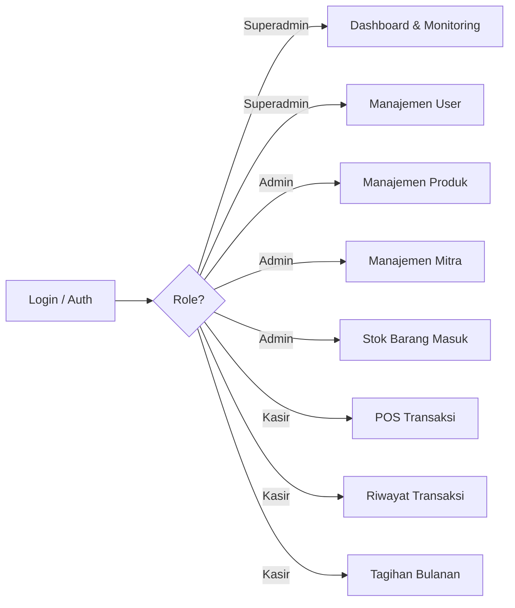
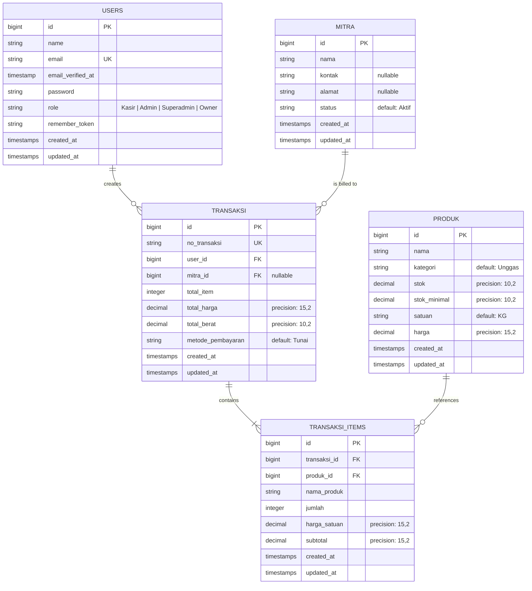

# Software Requirements Specification (SRS)

## JoFresh Inventory System (JIS)

| Dokumen       | Detail                                      |
| ------------- | ------------------------------------------- |
| **Versi**     | 1.0                                         |
| **Tanggal**   | 20 April 2026                               |
| **Sistem**    | JoFresh Inventory System (JIS)              |
| **Platform**  | Web Application                             |
| **Framework** | Laravel 13, PHP 8.3, MySQL, Tailwind CSS 4  |

---

## Daftar Isi

1. [Pendahuluan](#1-pendahuluan)
2. [Deskripsi Umum Sistem](#2-deskripsi-umum-sistem)
3. [Pemangku Kepentingan & Aktor](#3-pemangku-kepentingan--aktor)
4. [Kebutuhan Fungsional](#4-kebutuhan-fungsional)
5. [Kebutuhan Non-Fungsional](#5-kebutuhan-non-fungsional)
6. [Model Data](#6-model-data)
7. [Antarmuka Sistem](#7-antarmuka-sistem)
8. [Batasan & Asumsi](#8-batasan--asumsi)
9. [Lampiran](#9-lampiran)

---

## 1. Pendahuluan

### 1.1 Tujuan Dokumen

Dokumen Software Requirements Specification (SRS) ini bertujuan untuk mendefinisikan secara lengkap dan terstruktur seluruh kebutuhan fungsional dan non-fungsional dari sistem **JoFresh Inventory System (JIS)**. Dokumen ini menjadi acuan utama bagi tim pengembang, penguji, dan pemangku kepentingan dalam proses pengembangan, pengujian, serta pemeliharaan sistem.

### 1.2 Ruang Lingkup Sistem

JoFresh Inventory System (JIS) adalah sistem berbasis web yang dirancang untuk mengelola inventori, transaksi penjualan, dan penagihan pada bisnis distribusi unggas (ayam dan bebek) milik JoFresh. Sistem ini mencakup:

- **Manajemen Produk & Stok** — pencatatan produk, kategori, harga, dan monitoring stok.
- **Manajemen Mitra** — pengelolaan data pelanggan mitra bisnis.
- **Point of Sale (POS)** — pembuatan transaksi penjualan real-time.
- **Riwayat Transaksi** — pencatatan dan penelusuran histori transaksi kasir.
- **Tagihan Bulanan** — pengelompokan transaksi per mitra dan pembuatan invoice tagihan bulanan.
- **Dashboard & Monitoring** — ringkasan performa bisnis untuk pemilik usaha.
- **Manajemen Pengguna** — pengelolaan akun dan hak akses berbasis role.

### 1.3 Definisi, Akronim, dan Singkatan

| Istilah            | Definisi                                                                 |
| ------------------ | ------------------------------------------------------------------------ |
| **JIS**            | JoFresh Inventory System                                                 |
| **POS**            | Point of Sale — antarmuka kasir untuk membuat transaksi penjualan        |
| **Mitra**          | Pelanggan bisnis (B2B) yang bertransaksi dengan metode pembayaran tempo  |
| **Tempo**          | Metode pembayaran dengan jatuh tempo (bukan tunai langsung)              |
| **Invoice**        | Dokumen tagihan yang diterbitkan kepada mitra berdasarkan transaksi      |
| **Stok Minimal**   | Batas minimum stok produk sebelum sistem memberikan peringatan           |
| **CRUD**           | Create, Read, Update, Delete — operasi dasar pada data                   |
| **SRS**            | Software Requirements Specification                                      |
| **RBAC**           | Role-Based Access Control                                                 |

### 1.4 Referensi

- IEEE 830-1998 — Standar format Software Requirements Specification
- Laravel 13 Documentation — https://laravel.com/docs
- Use Case Diagram JIS — `docs/usecase_diagram.puml`

---

## 2. Deskripsi Umum Sistem

### 2.1 Perspektif Sistem

JIS merupakan sistem web mandiri (*standalone web application*) yang dibangun menggunakan arsitektur **Model-View-Controller (MVC)** dengan framework Laravel. Sistem ini berjalan di lingkungan server lokal (XAMPP) dengan database MySQL, dan diakses melalui browser web.

### 2.2 Arsitektur Teknologi

| Layer          | Teknologi                                           |
| -------------- | --------------------------------------------------- |
| **Backend**    | PHP 8.3, Laravel 13                                 |
| **Frontend**   | Blade Template Engine, Tailwind CSS 4, Vanilla JS   |
| **Database**   | MySQL 8.x (database: `jofresh`)                     |
| **Build Tool** | Vite 8                                              |
| **Server**     | Apache (XAMPP)                                       |
| **Auth**       | Laravel built-in authentication + custom RBAC middleware |
| **External**   | Midtrans Payment Gateway *(planned)*                |

### 2.3 Fungsi Utama Sistem



### 2.4 Karakteristik Pengguna

| Pengguna                 | Tingkat Keahlian | Deskripsi                                      |
| ------------------------ | ---------------- | ---------------------------------------------- |
| Owner (Superadmin)       | Menengah         | Pemilik usaha, memantau performa bisnis        |
| Admin                    | Menengah         | Staff yang mengelola data master produk & mitra |
| Kasir                    | Dasar            | Operator POS yang membuat transaksi harian      |

---

## 3. Pemangku Kepentingan & Aktor

### 3.1 Aktor Internal

#### 3.1.1 Owner (Superadmin)
- **Deskripsi**: Pemilik usaha JoFresh yang bertindak sebagai superadmin sistem.
- **Hak Akses**:
  - Melihat Dashboard (ringkasan penjualan, stok, mitra, tren)
  - Melihat Semua Transaksi dari seluruh kasir
  - Mengelola Akun Pengguna (CRUD: Admin, Kasir, Owner)
- **Redirect setelah login**: `/dashboard`

#### 3.1.2 Admin
- **Deskripsi**: Staff administratif yang mengelola data master sistem.
- **Hak Akses**:
  - Mengelola Data Produk (CRUD: nama, kategori, harga, stok, stok minimal, satuan)
  - Memasukkan Stok Barang Masuk
  - Mengelola Data Mitra (CRUD: nama, kontak, alamat, status)
- **Redirect setelah login**: `/admin/produk`

#### 3.1.3 Kasir
- **Deskripsi**: Operator Point of Sale (POS) yang memproses transaksi harian.
- **Hak Akses**:
  - Membuat Transaksi Baru (POS)
  - Melihat Riwayat Transaksi pribadi
  - Generate Tagihan Bulanan per mitra
- **Redirect setelah login**: `/kasir/transaksi`

### 3.2 Aktor Eksternal

#### 3.2.1 Midtrans (Payment Gateway)
- **Deskripsi**: Sistem pembayaran eksternal yang diintegrasikan untuk generate QR Code pembayaran dan verifikasi status pembayaran.
- **Status**: *Planned — belum terimplementasi*
- **Interaksi**: Generate QR Code, Verifikasi Pembayaran

---

## 4. Kebutuhan Fungsional

### 4.1 Modul Autentikasi (AUTH)

#### FR-AUTH-001: Login

| Atribut       | Detail                                                        |
| ------------- | ------------------------------------------------------------- |
| **ID**        | FR-AUTH-001                                                   |
| **Prioritas** | Tinggi                                                        |
| **Aktor**     | Owner, Admin, Kasir                                           |
| **Deskripsi** | Sistem menyediakan halaman login untuk autentikasi pengguna   |

**Prasyarat:**
- Pengguna belum login (session tidak aktif)

**Alur Utama:**
1. Pengguna mengakses halaman utama (`/`)
2. Sistem menampilkan form login dengan input Email dan Password
3. Pengguna mengisi kredensial dan menekan tombol Login
4. Sistem memvalidasi:
   - Email harus terisi dan berformat email valid
   - Password harus terisi
5. Sistem memverifikasi kredensial terhadap database
6. Jika valid, sistem membuat session dan me-redirect sesuai role:
   - `Superadmin` → `/dashboard`
   - `Admin` → `/admin/produk`
   - `Kasir` → `/kasir/transaksi`

**Alur Alternatif:**
- **A1**: Jika kredensial tidak valid, sistem menampilkan pesan error *"Akun tidak terdaftar"* dan tetap di halaman login
- **A2**: Jika pengguna sudah login, sistem langsung me-redirect ke halaman sesuai role

**Validasi:**
| Field      | Aturan                       |
| ---------- | ---------------------------- |
| `email`    | Required, format email valid |
| `password` | Required                     |

---

#### FR-AUTH-002: Logout

| Atribut       | Detail                                                     |
| ------------- | ---------------------------------------------------------- |
| **ID**        | FR-AUTH-002                                                |
| **Prioritas** | Tinggi                                                     |
| **Aktor**     | Owner, Admin, Kasir                                        |
| **Deskripsi** | Sistem menyediakan fungsi logout untuk mengakhiri session   |

**Alur Utama:**
1. Pengguna menekan tombol Logout
2. Sistem menghapus session dan regenerate token CSRF
3. Sistem me-redirect pengguna ke halaman login (`/`)

---

### 4.2 Modul Dashboard & Monitoring (DASH)

#### FR-DASH-001: Melihat Dashboard

| Atribut       | Detail                                                                 |
| ------------- | ---------------------------------------------------------------------- |
| **ID**        | FR-DASH-001                                                            |
| **Prioritas** | Tinggi                                                                 |
| **Aktor**     | Owner (Superadmin)                                                     |
| **Deskripsi** | Sistem menampilkan ringkasan statistik bisnis pada halaman dashboard    |

**Data yang ditampilkan:**

| Komponen               | Sumber Data                            | Keterangan                                        |
| ---------------------- | -------------------------------------- | ------------------------------------------------- |
| Penjualan Hari Ini     | `transaksi` (filter tanggal hari ini)  | Total nominal penjualan hari ini                  |
| Total Transaksi        | `transaksi` (count)                    | Jumlah seluruh transaksi                          |
| Total Mitra            | `mitra` (count)                        | Jumlah mitra terdaftar                            |
| Total Stok             | `produk` (sum stok)                    | Total stok seluruh produk (dalam satuan Ekor)     |
| Alert Stok Rendah      | `produk` (stok < stok_minimal)         | Peringatan berwarna merah jika ada stok rendah    |
| Tren Penjualan 7 Hari  | `transaksi` (group by date, 7 hari)    | Chart garis tren penjualan                        |
| Distribusi per Produk  | `transaksi` (group by produk)          | Chart distribusi penjualan per produk             |

**Prasyarat:**
- Pengguna telah login dengan role `Superadmin`

---

#### FR-DASH-002: Melihat Semua Transaksi

| Atribut       | Detail                                                                 |
| ------------- | ---------------------------------------------------------------------- |
| **ID**        | FR-DASH-002                                                            |
| **Prioritas** | Tinggi                                                                 |
| **Aktor**     | Owner (Superadmin)                                                     |
| **Deskripsi** | Sistem menampilkan daftar seluruh transaksi dari semua kasir            |

**Alur Utama:**
1. Pengguna mengakses halaman Transaksi (`/transactions`)
2. Sistem mengambil data dari tabel `transaksi` beserta relasi `user` (kasir)
3. Sistem menampilkan tabel transaksi dengan urutan terbaru (desc)

**Kolom yang ditampilkan:**
- No Transaksi
- Nama Kasir
- Total Item
- Total Harga
- Metode Pembayaran
- Tanggal & Waktu

---

### 4.3 Modul Manajemen Pengguna (USER)

#### FR-USER-001: Melihat Daftar Pengguna

| Atribut       | Detail                                                      |
| ------------- | ----------------------------------------------------------- |
| **ID**        | FR-USER-001                                                 |
| **Prioritas** | Tinggi                                                      |
| **Aktor**     | Owner (Superadmin)                                          |
| **Deskripsi** | Sistem menampilkan daftar semua akun pengguna terdaftar      |

**Alur Utama:**
1. Pengguna mengakses halaman Users (`/users`)
2. Sistem menampilkan tabel daftar user dengan kolom: Nama, Email, Role, Tanggal Dibuat

---

#### FR-USER-002: Menambah Pengguna Baru

| Atribut       | Detail                                                     |
| ------------- | ---------------------------------------------------------- |
| **ID**        | FR-USER-002                                                |
| **Prioritas** | Tinggi                                                     |
| **Aktor**     | Owner (Superadmin)                                         |
| **Deskripsi** | Sistem memungkinkan pembuatan akun pengguna baru            |

**Validasi:**
| Field      | Aturan                                           |
| ---------- | ------------------------------------------------ |
| `name`     | Required, string, max 255 karakter               |
| `email`    | Required, email, max 255 karakter, unique di tabel users |
| `password` | Required, string, min 8 karakter                 |
| `role`     | Required, enum: `Kasir`, `Admin`, `Superadmin`, `Owner` |

**Alur Utama:**
1. Pengguna mengisi form Tambah User
2. Sistem memvalidasi input
3. Sistem menyimpan data dengan password ter-hash (bcrypt)
4. Sistem mengembalikan response JSON dengan status 201

---

#### FR-USER-003: Mengubah Data Pengguna

| Atribut       | Detail                                                     |
| ------------- | ---------------------------------------------------------- |
| **ID**        | FR-USER-003                                                |
| **Prioritas** | Sedang                                                     |
| **Aktor**     | Owner (Superadmin)                                         |
| **Deskripsi** | Sistem memungkinkan perubahan data akun pengguna            |

**Alur Utama:**
1. Pengguna memilih user yang akan diedit
2. Sistem menampilkan form edit dengan data terpopulasi
3. Pengguna mengubah data dan menyimpan
4. Sistem memvalidasi (password opsional — hanya diupdate jika diisi)
5. Sistem menyimpan perubahan

---

#### FR-USER-004: Menghapus Pengguna

| Atribut       | Detail                                                     |
| ------------- | ---------------------------------------------------------- |
| **ID**        | FR-USER-004                                                |
| **Prioritas** | Sedang                                                     |
| **Aktor**     | Owner (Superadmin)                                         |
| **Deskripsi** | Sistem memungkinkan penghapusan akun pengguna               |

**Alur Utama:**
1. Pengguna menekan tombol hapus pada user yang dipilih
2. Sistem menampilkan konfirmasi
3. Jika dikonfirmasi, sistem menghapus data user dari database
4. Sistem mengembalikan response JSON sukses

---

### 4.4 Modul Master Data — Produk (PROD)

#### FR-PROD-001: Melihat Daftar Produk

| Atribut       | Detail                                                           |
| ------------- | ---------------------------------------------------------------- |
| **ID**        | FR-PROD-001                                                      |
| **Prioritas** | Tinggi                                                           |
| **Aktor**     | Admin                                                            |
| **Deskripsi** | Sistem menampilkan daftar seluruh produk beserta status stok      |

**Data yang ditampilkan:**
| Kolom         | Keterangan                                                 |
| ------------- | ---------------------------------------------------------- |
| Nama Produk   | Nama produk unggas                                          |
| Kategori      | Jenis kategori (default: Unggas)                            |
| Stok          | Jumlah stok saat ini                                        |
| Stok Minimal  | Batas minimum stok untuk peringatan                         |
| Satuan        | Satuan produk (Ekor)                                        |
| Harga         | Harga per satuan (format Rupiah)                            |
| Status        | Badge otomatis: `Tersedia`, `Stok Rendah`, `Stok Habis`    |

**Logika Status Otomatis:**
- `stok <= 0` → **Stok Habis** (badge merah)
- `stok < stok_minimal` → **Stok Rendah** (badge kuning)
- `stok >= stok_minimal` → **Tersedia** (badge hijau)

**Ringkasan di header halaman:**
- Jumlah produk dengan status `Stok Rendah`
- Jumlah produk dengan status `Stok Habis`

---

#### FR-PROD-002: Menambah Produk Baru

| Atribut       | Detail                                                     |
| ------------- | ---------------------------------------------------------- |
| **ID**        | FR-PROD-002                                                |
| **Prioritas** | Tinggi                                                     |
| **Aktor**     | Admin                                                      |
| **Deskripsi** | Sistem memungkinkan penambahan produk baru ke inventori     |

**Validasi:**
| Field          | Aturan                            |
| -------------- | --------------------------------- |
| `nama`         | Required, string, max 255         |
| `kategori`     | Required, string, max 255         |
| `stok`         | Required, numeric, min 0          |
| `stok_minimal` | Required, numeric, min 0          |
| `satuan`       | Required, string                  |
| `harga`        | Required, numeric, min 0          |

**Response:** JSON 201 dengan data produk termasuk computed attributes (`status`, `status_badge`, `harga_format`)

---

#### FR-PROD-003: Mengubah Data Produk

| Atribut       | Detail                                                      |
| ------------- | ----------------------------------------------------------- |
| **ID**        | FR-PROD-003                                                 |
| **Prioritas** | Tinggi                                                      |
| **Aktor**     | Admin                                                       |
| **Deskripsi** | Sistem memungkinkan perubahan data produk yang sudah ada     |

**Alur Utama:** Sama dengan FR-PROD-002, dengan data terpopulasi dari produk yang dipilih.

---

#### FR-PROD-004: Menghapus Produk

| Atribut       | Detail                                                     |
| ------------- | ---------------------------------------------------------- |
| **ID**        | FR-PROD-004                                                |
| **Prioritas** | Sedang                                                     |
| **Aktor**     | Admin                                                      |
| **Deskripsi** | Sistem memungkinkan penghapusan produk dari inventori       |

---

### 4.5 Modul Master Data — Mitra (MITRA)

#### FR-MITRA-001: Melihat Daftar Mitra

| Atribut       | Detail                                                      |
| ------------- | ----------------------------------------------------------- |
| **ID**        | FR-MITRA-001                                                |
| **Prioritas** | Tinggi                                                      |
| **Aktor**     | Admin                                                       |
| **Deskripsi** | Sistem menampilkan daftar seluruh mitra bisnis terdaftar     |

**Kolom yang ditampilkan:** Nama, Kontak, Alamat, Status (Aktif/Nonaktif)

---

#### FR-MITRA-002: Menambah Mitra Baru

| Atribut       | Detail                                                     |
| ------------- | ---------------------------------------------------------- |
| **ID**        | FR-MITRA-002                                               |
| **Prioritas** | Tinggi                                                     |
| **Aktor**     | Admin                                                      |
| **Deskripsi** | Sistem memungkinkan pendaftaran mitra bisnis baru           |

**Validasi:**
| Field    | Aturan                        |
| -------- | ----------------------------- |
| `nama`   | Required, string, max 255     |
| `kontak` | Nullable, string, max 50      |
| `alamat` | Nullable, string, max 500     |

**Catatan:** Status mitra secara default diisi `Aktif` saat pembuatan.

---

#### FR-MITRA-003: Mengubah Data Mitra

| Atribut       | Detail                                                     |
| ------------- | ---------------------------------------------------------- |
| **ID**        | FR-MITRA-003                                               |
| **Prioritas** | Sedang                                                     |
| **Aktor**     | Admin                                                      |
| **Deskripsi** | Sistem memungkinkan perubahan data mitra yang sudah ada     |

---

#### FR-MITRA-004: Menghapus Mitra

| Atribut       | Detail                                                     |
| ------------- | ---------------------------------------------------------- |
| **ID**        | FR-MITRA-004                                               |
| **Prioritas** | Sedang                                                     |
| **Aktor**     | Admin                                                      |
| **Deskripsi** | Sistem memungkinkan penghapusan data mitra                 |

---

### 4.6 Modul Stok Barang Masuk (STOK)

#### FR-STOK-001: Memasukkan Stok Barang

| Atribut       | Detail                                                                |
| ------------- | --------------------------------------------------------------------- |
| **ID**        | FR-STOK-001                                                           |
| **Prioritas** | Tinggi                                                                |
| **Aktor**     | Admin                                                                 |
| **Deskripsi** | Sistem menyediakan halaman pencatatan stok barang masuk ke inventori  |

**Alur Utama:**
1. Admin mengakses halaman Stok Masuk (`/admin/stok-masuk`)
2. Sistem menampilkan form untuk input stok barang masuk
3. Admin memilih produk dan mengisi jumlah stok yang masuk
4. Sistem mengupdate stok produk di tabel `produk`

---

### 4.7 Modul Transaksi / POS (TXN)

#### FR-TXN-001: Membuat Transaksi Baru (POS)

| Atribut       | Detail                                                                |
| ------------- | --------------------------------------------------------------------- |
| **ID**        | FR-TXN-001                                                            |
| **Prioritas** | Tinggi                                                                |
| **Aktor**     | Kasir                                                                 |
| **Deskripsi** | Sistem menyediakan antarmuka POS untuk membuat transaksi penjualan    |

**Prasyarat:**
- Kasir telah login
- Terdapat produk dengan stok > 0
- Terdapat mitra dengan status Aktif

**Alur Utama:**
1. Kasir mengakses halaman Transaksi (`/kasir/transaksi`)
2. Sistem menampilkan:
   - Daftar produk tersedia (stok > 0), diurutkan berdasarkan nama
   - Daftar mitra aktif
   - Area keranjang belanja (cart)
3. Kasir memilih mitra tujuan
4. Kasir menambahkan item ke keranjang:
   - Memilih produk
   - Menentukan jumlah (dalam satuan Ekor)
5. Sistem menghitung subtotal per item secara otomatis (`harga × jumlah`)
6. Kasir menekan tombol Checkout
7. Sistem memproses transaksi dalam database transaction:
   a. Memvalidasi stok cukup untuk setiap item
   b. Mengurangi stok produk (`produk.stok -= jumlah`)
   c. Generate nomor transaksi: `TXN-YYYYMMDD-NNN`
   d. Menyimpan record ke tabel `transaksi`
   e. Menyimpan detail item ke tabel `transaksi_items`
8. Sistem mengembalikan response JSON 201 dengan data transaksi lengkap

**Alur Alternatif:**
- **A1**: Jika stok tidak cukup, sistem mengembalikan error 422 dengan pesan *"Stok {nama_produk} tidak cukup. Tersisa: {stok} ekor."*

**Validasi:**
| Field                 | Aturan                              |
| --------------------- | ----------------------------------- |
| `mitra_id`            | Required, harus ada di tabel mitra  |
| `items`               | Required, array, min 1 item         |
| `items.*.produk_id`   | Required, harus ada di tabel produk |
| `items.*.jumlah`      | Required, integer, min 1            |

**Format Nomor Transaksi:**
```
TXN-YYYYMMDD-NNN
```
- `YYYY` = Tahun (4 digit)
- `MM` = Bulan (2 digit)
- `DD` = Tanggal (2 digit)
- `NNN` = Nomor urut harian (3 digit, zero-padded)
- Contoh: `TXN-20260420-001`, `TXN-20260420-002`

**Data yang disimpan:**
| Tabel            | Kolom                                                         |
| ---------------- | ------------------------------------------------------------- |
| `transaksi`      | no_transaksi, user_id, mitra_id, total_item, total_harga, total_berat, metode_pembayaran |
| `transaksi_items`| transaksi_id, produk_id, nama_produk, jumlah, harga_satuan, subtotal |

---

#### FR-TXN-002: Melihat Riwayat Transaksi

| Atribut       | Detail                                                              |
| ------------- | ------------------------------------------------------------------- |
| **ID**        | FR-TXN-002                                                          |
| **Prioritas** | Tinggi                                                              |
| **Aktor**     | Kasir                                                               |
| **Deskripsi** | Sistem menampilkan riwayat transaksi yang dibuat oleh kasir tersebut |

**Prasyarat:**
- Kasir telah login

**Alur Utama:**
1. Kasir mengakses halaman Riwayat (`/kasir/riwayat`)
2. Sistem mengambil data transaksi milik kasir yang login (`user_id = Auth::id()`)
3. Sistem menampilkan:
   - **Summary cards:** Total Transaksi, Total Pendapatan, Total Item Terjual
   - **Tabel riwayat** dengan detail transaksi dan item yang expandable

**Filter:**
- Filter berdasarkan tanggal (query parameter `date`)
- Jika tanggal tidak dipilih, menampilkan semua transaksi

**Relasi yang di-load:** `mitra`, `items`

---

### 4.8 Modul Tagihan Bulanan (TAG)

#### FR-TAG-001: Generate Tagihan Bulanan

| Atribut       | Detail                                                                    |
| ------------- | ------------------------------------------------------------------------- |
| **ID**        | FR-TAG-001                                                                |
| **Prioritas** | Tinggi                                                                    |
| **Aktor**     | Kasir                                                                     |
| **Deskripsi** | Sistem mengelompokkan transaksi per mitra per bulan dan menghitung tagihan |

**Alur Utama:**
1. Kasir mengakses halaman Tagihan (`/kasir/tagihan`)
2. Kasir memilih bulan dan tahun (default: bulan & tahun berjalan)
3. Sistem mengambil semua transaksi milik kasir pada periode yang dipilih
4. Sistem mengelompokkan transaksi berdasarkan `mitra_id`
5. Untuk setiap mitra, sistem menghitung:
   - Total tagihan (`sum(total_harga)`)
   - Jumlah transaksi (`count`)
6. Sistem menampilkan:
   - **Summary cards:** Total Mitra, Total Tagihan, Sudah Lunas, Belum Lunas
   - **Daftar tagihan per mitra** dengan detail transaksi

**Filter:**
| Parameter | Aturan          | Default         |
| --------- | --------------- | --------------- |
| `bulan`   | Integer (1-12)  | Bulan sekarang  |
| `tahun`   | Integer (YYYY)  | Tahun sekarang  |

**Sub-proses (<<include>> pada Use Case):**
1. **Mengambil Data Transaksi** — query transaksi filtered by user, bulan, tahun
2. **Mengelompokkan Transaksi per Mitra** — `groupBy('mitra_id')`
3. **Menghitung Total Tagihan** — `sum('total_harga')` per mitra
4. **Membuat Invoice** — render tampilan tagihan per mitra
5. **Generate QR Code** — *(planned: integrasi Midtrans)*

---

### 4.9 Modul Pembayaran (PAY) — *Planned*

#### FR-PAY-001: Generate QR Code Pembayaran

| Atribut       | Detail                                                         |
| ------------- | -------------------------------------------------------------- |
| **ID**        | FR-PAY-001                                                     |
| **Prioritas** | Sedang                                                         |
| **Aktor**     | Midtrans (External System)                                     |
| **Status**    | *Planned — belum terimplementasi*                              |
| **Deskripsi** | Integrasi Midtrans untuk generate QR Code QRIS pembayaran      |

---

#### FR-PAY-002: Verifikasi Pembayaran

| Atribut       | Detail                                                              |
| ------------- | ------------------------------------------------------------------- |
| **ID**        | FR-PAY-002                                                          |
| **Prioritas** | Sedang                                                              |
| **Aktor**     | Midtrans (External System)                                          |
| **Status**    | *Planned — belum terimplementasi*                                   |
| **Deskripsi** | Midtrans mengirim callback notifikasi status pembayaran ke sistem   |

**Sub-proses:** <<include>> Update Status Pembayaran

---

#### FR-PAY-003: Melihat Status Pembayaran

| Atribut       | Detail                                                         |
| ------------- | -------------------------------------------------------------- |
| **ID**        | FR-PAY-003                                                     |
| **Prioritas** | Sedang                                                         |
| **Aktor**     | Kasir                                                          |
| **Status**    | *Planned — halaman tersedia di `/admin/pembayaran-mitra`*      |
| **Deskripsi** | Kasir dapat melihat status pembayaran tagihan mitra             |

---

## 5. Kebutuhan Non-Fungsional

### 5.1 Keamanan (Security)

| ID           | Kebutuhan                                                                 |
| ------------ | ------------------------------------------------------------------------- |
| NFR-SEC-001  | Password disimpan dalam bentuk hash menggunakan bcrypt (12 rounds)        |
| NFR-SEC-002  | Session di-regenerate setelah login berhasil untuk mencegah session fixation |
| NFR-SEC-003  | Session di-invalidate dan token CSRF di-regenerate saat logout            |
| NFR-SEC-004  | Sistem menerapkan RBAC melalui middleware `CheckRole` pada setiap route group |
| NFR-SEC-005  | Halaman guest-only dilindungi middleware `guest` (redirect jika sudah login) |
| NFR-SEC-006  | Proteksi CSRF aktif pada semua form POST/PUT/DELETE                       |

### 5.2 Performa (Performance)

| ID           | Kebutuhan                                                                 |
| ------------ | ------------------------------------------------------------------------- |
| NFR-PERF-001 | Halaman harus dimuat dalam waktu < 3 detik pada jaringan lokal            |
| NFR-PERF-002 | Transaksi POS menggunakan database transaction untuk memastikan atomicity |
| NFR-PERF-003 | Query menggunakan eager loading (`with()`) untuk mengurangi N+1 problem   |

### 5.3 Keandalan (Reliability)

| ID           | Kebutuhan                                                                        |
| ------------ | -------------------------------------------------------------------------------- |
| NFR-REL-001  | Operasi stok (pengurangan) dilakukan dalam database transaction                   |
| NFR-REL-002  | Validasi stok dilakukan sebelum pengurangan untuk mencegah stok negatif          |
| NFR-REL-003  | Cascade delete diterapkan pada relasi transaksi → transaksi_items                 |
| NFR-REL-004  | Foreign key mitra_id pada transaksi menggunakan `SET NULL` saat mitra dihapus    |

### 5.4 Usability

| ID           | Kebutuhan                                                                 |
| ------------ | ------------------------------------------------------------------------- |
| NFR-USE-001  | UI menggunakan desain modern SaaS-style dengan color scheme JoFresh Blue  |
| NFR-USE-002  | Sistem menampilkan toast notification untuk operasi berhasil/gagal        |
| NFR-USE-003  | Badge status stok berwarna dinamis (hijau/kuning/merah)                   |
| NFR-USE-004  | Format mata uang menggunakan Rupiah (Rp) dengan pemisah ribuan titik      |
| NFR-USE-005  | Responsive layout yang dapat diakses dari berbagai ukuran layar           |

### 5.5 Maintainability

| ID           | Kebutuhan                                                                 |
| ------------ | ------------------------------------------------------------------------- |
| NFR-MNT-001  | Arsitektur menggunakan pola MVC (Model-View-Controller) Laravel           |
| NFR-MNT-002  | Computed attributes (status, harga_format) didefinisikan sebagai Eloquent accessors |
| NFR-MNT-003  | Migrasi database terversioned untuk tracking perubahan skema              |

---

## 6. Model Data

### 6.1 Entity Relationship Diagram (ERD)



### 6.2 Daftar Tabel

| No | Tabel             | Deskripsi                                         | Relasi                           |
| -- | ----------------- | ------------------------------------------------- | -------------------------------- |
| 1  | `users`           | Data akun pengguna sistem                         | 1:N → transaksi                  |
| 2  | `produk`          | Data master produk inventori                      | 1:N → transaksi_items            |
| 3  | `mitra`           | Data master pelanggan mitra bisnis                | 1:N → transaksi                  |
| 4  | `transaksi`       | Header transaksi penjualan                        | N:1 → users, N:1 → mitra        |
| 5  | `transaksi_items` | Detail item per transaksi                         | N:1 → transaksi, N:1 → produk   |
| 6  | `sessions`        | Data session pengguna aktif (Laravel built-in)    | N:1 → users                     |
| 7  | `cache`           | Cache data (Laravel built-in)                     | —                                |
| 8  | `password_reset_tokens` | Token reset password                        | —                                |

### 6.3 Constraint & Integritas Data

| Constraint                          | Tabel              | Keterangan                                      |
| ----------------------------------- | ------------------ | ----------------------------------------------- |
| `email` UNIQUE                      | `users`            | Tidak boleh ada duplikasi email                 |
| `no_transaksi` UNIQUE               | `transaksi`        | Nomor transaksi unik per record                 |
| `user_id` FK → `users.id` CASCADE   | `transaksi`        | Hapus user → hapus semua transaksi terkait      |
| `mitra_id` FK → `mitra.id` SET NULL | `transaksi`        | Hapus mitra → set mitra_id = NULL               |
| `transaksi_id` FK → `transaksi.id` CASCADE | `transaksi_items` | Hapus transaksi → hapus semua item       |
| `produk_id` FK → `produk.id` CASCADE | `transaksi_items` | Hapus produk → hapus item terkait              |

---

## 7. Antarmuka Sistem

### 7.1 Peta Halaman (Sitemap)

```
/                                   → Login Page (Guest Only)
├── /dashboard                      → Dashboard [Superadmin]
├── /transactions                   → Semua Transaksi [Superadmin]
├── /users                          → Manajemen User [Superadmin]
│
├── /admin/produk                   → Kelola Produk [Admin]
├── /admin/stok-masuk               → Stok Barang Masuk [Admin]
├── /admin/mitra                    → Kelola Mitra [Admin]
├── /admin/pembayaran-mitra         → Pembayaran Mitra [Admin] (Planned)
│
├── /kasir/transaksi                → POS Transaksi [Kasir]
├── /kasir/riwayat                  → Riwayat Transaksi [Kasir]
└── /kasir/tagihan                  → Tagihan Bulanan [Kasir]
```

### 7.2 Layout Templates

| Layout                    | Digunakan oleh            | Deskripsi                              |
| ------------------------- | ------------------------- | -------------------------------------- |
| `layouts/app.blade.php`   | Superadmin (Owner)        | Layout utama dengan sidebar navigasi   |
| `layouts/admin.blade.php` | Admin                     | Layout admin dengan sidebar navigasi   |
| `layouts/kasir.blade.php` | Kasir                     | Layout kasir dengan navigasi minimal   |

### 7.3 Daftar View

| No | View File                         | Route                  | Deskripsi                    |
| -- | --------------------------------- | ---------------------- | ---------------------------- |
| 1  | `auth/login.blade.php`            | `GET /`                | Halaman login                |
| 2  | `dashboard.blade.php`             | `GET /dashboard`       | Dashboard superadmin         |
| 3  | `transactions.blade.php`          | `GET /transactions`    | Daftar semua transaksi       |
| 4  | `users.blade.php`                 | `GET /users`           | Manajemen pengguna           |
| 5  | `admin/produk.blade.php`          | `GET /admin/produk`    | CRUD produk                  |
| 6  | `admin/stok-masuk.blade.php`      | `GET /admin/stok-masuk`| Input stok barang masuk      |
| 7  | `admin/mitra.blade.php`           | `GET /admin/mitra`     | CRUD mitra                   |
| 8  | `admin/pembayaran-mitra.blade.php`| `GET /admin/pembayaran-mitra` | Pembayaran mitra (planned) |
| 9  | `kasir/transaksi.blade.php`       | `GET /kasir/transaksi` | POS kasir                    |
| 10 | `kasir/riwayat.blade.php`         | `GET /kasir/riwayat`   | Riwayat transaksi kasir      |
| 11 | `kasir/tagihan.blade.php`         | `GET /kasir/tagihan`   | Tagihan bulanan              |

### 7.4 API Endpoints

| Method   | URL                   | Controller                    | Deskripsi                    |
| -------- | --------------------- | ----------------------------- | ---------------------------- |
| `POST`   | `/login`              | AuthController@login          | Proses autentikasi           |
| `POST`   | `/logout`             | AuthController@logout         | Proses logout                |
| `POST`   | `/users`              | UserController@store          | Tambah user baru             |
| `PUT`    | `/users/{id}`         | UserController@update         | Update data user             |
| `DELETE` | `/users/{id}`         | UserController@destroy        | Hapus user                   |
| `POST`   | `/admin/produk`       | ProdukController@store        | Tambah produk baru           |
| `PUT`    | `/admin/produk/{id}`  | ProdukController@update       | Update data produk           |
| `DELETE` | `/admin/produk/{id}`  | ProdukController@destroy      | Hapus produk                 |
| `POST`   | `/admin/mitra`        | MitraController@store         | Tambah mitra baru            |
| `PUT`    | `/admin/mitra/{id}`   | MitraController@update        | Update data mitra            |
| `DELETE` | `/admin/mitra/{id}`   | MitraController@destroy       | Hapus mitra                  |
| `POST`   | `/kasir/transaksi`    | KasirController@storeTransaksi| Simpan transaksi POS         |

---

## 8. Batasan & Asumsi

### 8.1 Batasan Sistem

1. Sistem hanya mendukung 4 role: `Superadmin`, `Owner`, `Admin`, `Kasir`
2. Kasir hanya dapat melihat transaksi miliknya sendiri (filter `user_id`)
3. Metode pembayaran saat ini hanya mendukung `Tempo` (kredit mitra)
4. Integrasi payment gateway Midtrans belum terimplementasi
5. Sistem berjalan di lingkungan lokal (XAMPP), belum di-deploy ke cloud
6. Tidak ada fitur registrasi mandiri — akun dibuat oleh Superadmin

### 8.2 Asumsi

1. Setiap transaksi penjualan ditujukan ke satu mitra (B2B model)
2. Satuan produk utama adalah "Ekor" untuk produk unggas
3. Stok selalu berkurang saat transaksi diproses (tidak ada fitur retur)
4. Satu kasir bertanggung jawab atas transaksi yang dibuatnya
5. Tagihan bulanan digenerate per kasir (bukan global)
6. Database menggunakan MySQL yang di-host di XAMPP lokal

---

## 9. Lampiran

### 9.1 Matriks Kebutuhan Fungsional

| ID           | Modul        | Aktor       | Prioritas | Status              |
| ------------ | ------------ | ----------- | --------- | ------------------- |
| FR-AUTH-001  | Autentikasi  | All         | Tinggi    | ✅ Implementasi     |
| FR-AUTH-002  | Autentikasi  | All         | Tinggi    | ✅ Implementasi     |
| FR-DASH-001  | Dashboard    | Superadmin  | Tinggi    | ✅ Implementasi     |
| FR-DASH-002  | Monitoring   | Superadmin  | Tinggi    | ✅ Implementasi     |
| FR-USER-001  | User Mgmt    | Superadmin  | Tinggi    | ✅ Implementasi     |
| FR-USER-002  | User Mgmt    | Superadmin  | Tinggi    | ✅ Implementasi     |
| FR-USER-003  | User Mgmt    | Superadmin  | Sedang    | ✅ Implementasi     |
| FR-USER-004  | User Mgmt    | Superadmin  | Sedang    | ✅ Implementasi     |
| FR-PROD-001  | Master Data  | Admin       | Tinggi    | ✅ Implementasi     |
| FR-PROD-002  | Master Data  | Admin       | Tinggi    | ✅ Implementasi     |
| FR-PROD-003  | Master Data  | Admin       | Tinggi    | ✅ Implementasi     |
| FR-PROD-004  | Master Data  | Admin       | Sedang    | ✅ Implementasi     |
| FR-MITRA-001 | Master Data  | Admin       | Tinggi    | ✅ Implementasi     |
| FR-MITRA-002 | Master Data  | Admin       | Tinggi    | ✅ Implementasi     |
| FR-MITRA-003 | Master Data  | Admin       | Sedang    | ✅ Implementasi     |
| FR-MITRA-004 | Master Data  | Admin       | Sedang    | ✅ Implementasi     |
| FR-STOK-001  | Master Data  | Admin       | Tinggi    | 🔶 Partial (view)  |
| FR-TXN-001   | Transaksi    | Kasir       | Tinggi    | ✅ Implementasi     |
| FR-TXN-002   | Transaksi    | Kasir       | Tinggi    | ✅ Implementasi     |
| FR-TAG-001   | Tagihan      | Kasir       | Tinggi    | ✅ Implementasi     |
| FR-PAY-001   | Pembayaran   | Midtrans    | Sedang    | ⬜ Planned          |
| FR-PAY-002   | Pembayaran   | Midtrans    | Sedang    | ⬜ Planned          |
| FR-PAY-003   | Pembayaran   | Kasir       | Sedang    | ⬜ Planned          |

### 9.2 Matriks RBAC (Role-Based Access Control)

| Fitur / Halaman            | Superadmin | Admin | Kasir | Midtrans |
| -------------------------- | :--------: | :---: | :---: | :------: |
| Login                      |     ✅     |  ✅   |  ✅   |    —     |
| Logout                     |     ✅     |  ✅   |  ✅   |    —     |
| Dashboard                  |     ✅     |  ❌   |  ❌   |    —     |
| Melihat Semua Transaksi    |     ✅     |  ❌   |  ❌   |    —     |
| Manajemen User (CRUD)      |     ✅     |  ❌   |  ❌   |    —     |
| Kelola Produk (CRUD)       |     ❌     |  ✅   |  ❌   |    —     |
| Stok Barang Masuk          |     ❌     |  ✅   |  ❌   |    —     |
| Kelola Mitra (CRUD)        |     ❌     |  ✅   |  ❌   |    —     |
| POS Transaksi              |     ❌     |  ❌   |  ✅   |    —     |
| Riwayat Transaksi          |     ❌     |  ❌   |  ✅   |    —     |
| Tagihan Bulanan            |     ❌     |  ❌   |  ✅   |    —     |
| Generate QR Code           |     —      |  —    |  —    |    ✅    |
| Verifikasi Pembayaran      |     —      |  —    |  —    |    ✅    |

### 9.3 Referensi File Kode Sumber

| Komponen        | File                                                    |
| --------------- | ------------------------------------------------------- |
| Routes          | `routes/web.php`                                        |
| Middleware RBAC | `app/Http/Middleware/CheckRole.php`                     |
| Auth Controller | `app/Http/Controllers/AuthController.php`               |
| Dashboard       | `app/Http/Controllers/DashboardController.php`          |
| User CRUD       | `app/Http/Controllers/UserController.php`               |
| Produk CRUD     | `app/Http/Controllers/ProdukController.php`             |
| Mitra CRUD      | `app/Http/Controllers/MitraController.php`              |
| Kasir POS       | `app/Http/Controllers/KasirController.php`              |
| Transaksi All   | `app/Http/Controllers/TransaksiController.php`          |
| Model User      | `app/Models/User.php`                                   |
| Model Produk    | `app/Models/Produk.php`                                 |
| Model Mitra     | `app/Models/Mitra.php`                                  |
| Model Transaksi | `app/Models/Transaksi.php`                              |
| Model TxnItem   | `app/Models/TransaksiItem.php`                          |
| Use Case Diagram| `docs/usecase_diagram.puml`                             |

---

> **Dokumen ini dibuat berdasarkan analisis kode sumber JoFresh Inventory System per tanggal 20 April 2026.**
> **Versi dokumen akan diperbarui seiring perkembangan sistem.**
